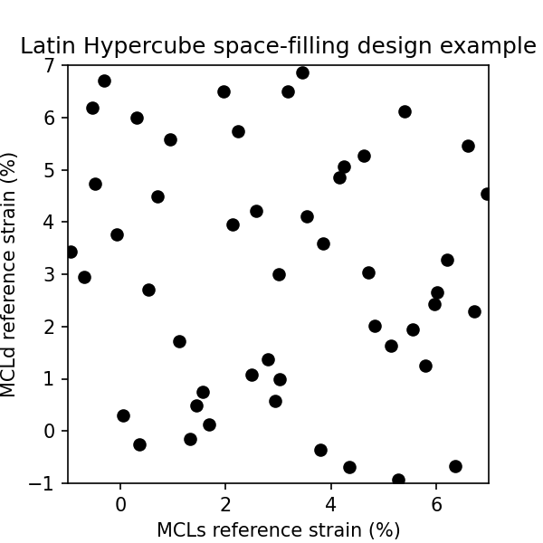

# jam-tka-ga

## (WIP) Using a genetic algorithm to determine the optimal ligament slack lengths & stiffnesses for a TKA knee:
### Step 1: Initial guesses using a Latin Hypercube space-filling design:

A Latin Hypercube (LH) space-filling design was used to generate an initial random sampling of ligament reference strains & stiffnesses within confidence intervals prescribed by [Smith et al. (2016)](https://asmedigitalcollection.asme.org/biomechanical/article/138/2/021017/371493/The-Influence-of-Component-Alignment-and-Ligament?casa_token=2rz_AJAmBlkAAAAA:ZDae_l5ySs9u3sIyrosvmf6vxlYejlnfEFcpZ8DU-Re5QZQeadutzB5qaswBBrFSw6nVLZbB):

Here, each of the 12 ligament bundles is assigned a reference strain and a stiffness, for a total of 24 values per LH permutation.

To fill the space, $24 \times 10 = 240$ permutations were generated.

Below is an example of the sampled reference strains for the deep and superficial MCL ligament. Each dot represents 1 of the 240 permuations:

The knee was then settled into equilibrium at full extension for each permutation.

The following plot demonstrates the effect of the sampling on the medial joint contact force (Note: WIP):

### Step 2: TBA

## (WIP) Generate AR visualisations of the contact locations using https://github.com/SoftTissueBiomechanicsLab/AR_Pipeline

TBA